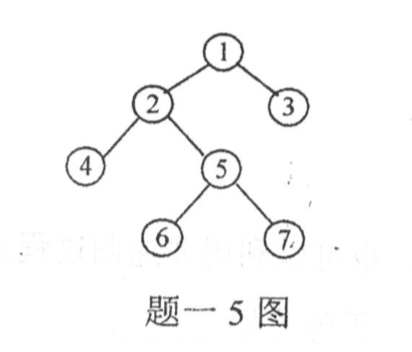
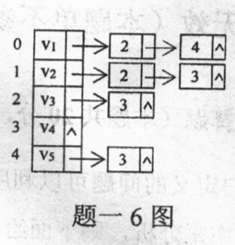

2015年“数据结构与C语言程序设计”(科目代码：991)

一、单项选择题
1．递归定义的问题可以利用递归过程求解，也可以利用非递归过程求解，若仅从运行的时间效率来分析，则下面给出的四种说法中，正确的是____。    
A．前者要比后者快   
√B．前者要比后者慢  
C．前者与后者相同   
D．两者不能做比较 

> 递归采用的是栈堆积的方式进行运算，每一次调用递归，内存都不断堆积，直到最后才求解，因此占用内存大，计算量成倍增加。所以递归过程较慢。

2．线性表采用顺序存储结构的优点之一是____。    
√A．存储密度(即存储利用率)高    
B．适用于各种逻辑结构的存储表示    
C．在表中进行插入操作的时间效率高    
D．在表中进行删除操作的时间效率高

> B错:有空间限制; CD错:插入和删除存在元素移动，速度慢 

3．若用STACK[n]表示某堆栈采用顺序存储结构，则下列关于堆栈及堆栈操作的叙述中，正确的是____。    
√A．堆栈的大小为n  
B．堆栈为空时n=0  
C．最多只能进行n次进栈和出栈操作   
D．n个元素依次进栈后，它们的出栈顺序一定与进栈顺序相反

> B 堆栈为空时n=-1 C 可以进行无限次进栈出栈  D 每个元素进栈后又立马出栈，就可以保证元素依次进栈，且进栈顺序与出栈一致

4．仅从形态上看，具有n个结点且深度也为n的二叉树一共有____。   
A．2n种        B．2^n种        √C．2^(n-1)种        D．2^n-1种

> 除了第一层根节点不动，其余n-1层每层都有两种可能，可能为左节点或右节点

5．对于题一5图所示的二叉树，若对其遍历后得到的遍历序列为4, 6, 7, 5, 2, 3, 1，则由此可以断定所采用的遍历方法是____。  
A．前序遍历        B．中序遍历        √C．后序遍历        D．按层次遍历。

6．已知某无回路的有向图G的邻接表如题一6图所示。下列四个顶点序列中，不属于G的拓扑序列的是____。  
A．v1, v2, v3, v5, v4    
√B．v1, v2, v3, v4, v5    
C．v2, v1, v3, v5, v4    
D．v2, v1, v5, v3, v4   
> 拓扑排序中没有前驱的结点是不区分顺序的;  
拓扑排序的步骤：  
1、在有向图中选一个没有前驱的顶点且输出之。  
2、从图中删除该顶点和所有以它为尾的弧。    
3、重复上述两步，直至全部顶点均已输出;或者当图中不存在无前驱的顶点为止    
**v4必须在v5之后**

  

7．若具有n个顶点的连通图采用邻接矩阵表示，则该邻接矩阵中的非零元素的个数至少是____。   
√A．2(n-1)            B．n-1        C．n+1             D．n/2。
> 连通图即指无向图；  
  无向图的每条边同时关联两个顶点,因此邻接矩阵中每条边被存储了两次。因此至少有2(n-1)个非零元素

8．在长度为n且元素按值有序排列的顺序表中进行折半查找，查找每个元素所进行的元素之间的比较次数____对应的“判定树”的深度(设深度≥2)。  
A．大于          B．等于                C．小于                D．小于或等于。

9．若散列表的长度为m，待散列的元素的个数为n，装填因子为𝛔，则散列表的平均查找长度____。     
A．与m直接相关        B．与n直接相关    C．与𝛔直接相关        D．与m、n和𝛔都直接相关。

10．若对序列(2, 12, 16, 70, 5, 10)按值从小到大进行排序，前三趟排序的结果分别为：    
    第1趟排序的结果：(2, 12, 16, 5, 10, 70)，    
    第2趟排序的结果：(2, 12, 5, 10, 16, 70)，    
    第3趟排序的结果：(2, 5, 10, 12, 16, 70)，    
则由此可以断定，该排序过程采用的排序方法是____。  
A．插入排序法         B．选择排序法        C．泡排序法                D．快速排序法。

二、填空题
1．若需要频繁地对线性表进行插入或删除操作，则该线性表宜采用____存储结构。  
2．若要以复杂度为O(1)的时间代价将两个单链表链接成一个单链表，则这两个单链表分别应该为____。  
3．若堆栈采用单链表作为存储结构，链结点构造为 data link，且栈顶指针为top，则在该堆栈中插入一个由p指的新结点所执行的操作(语句)依次为____。  
4．若某满二叉树的结点总数为20至40之间的一个素数，则该满二叉树中叶结点的数目为____。  
5．若某二叉树的中序遍历序列为(d, b, a, e, c, f)，按层次遍历序列为(a, b, c, d, e, f)，则该二叉树的后序遍历序列为____。  
6．一个具有36条边的非连通无向图中至少有____个顶点。   
7．除了拓扑排序方法外，判断一个有向图是否存在回路的方法还有____。 
8．在顺序表(6, 15, 30, 37, 65, 68, 70, 72, 89, 99)中采用折半查找法查找元素37的过程中与表中进行过比较的元素依次为____。  
9．由经验得知，为了降低发生散列冲突的可能性，在采用除留余数法构造的散列函数H(k)=k MOD p中，p的取值最好是____。（k为关键字）    
10．有一种排序方法的基本原理是：每一趟排序都从一个未排序的序列中选择第一个元素作为分界元素，该分界元素将当前未排序的序列分成前后两个部分，
前一部分中的所有元素均小于等于分界元素，后一部分中的所有元素均大于等于分界元素，
而分界元素处在排序的最终位置然后分别对被分成的两部分中元素个数超过1的部分重复上述过程，直至排序结束。这种排序方法是____。 

三、综合题
1．假设n为2的乘幂，即n=2, 4, 8, 16，…。请用大O符号形式写出下列函数的时间复杂度。
main( )
{ int n, x=2, sum=0;
  scanf(“%d”, &n);
  while(x<n/2){
      x=2*x;
      sum++;
   }
   printf(“sum=%d”, sum);
}
2．已知某二叉树的前序遍历序列为A, B, E, F, G, C, H, D, I, J，中序遍历序列为E, F, G, B, H, C, I, J, D, A，请画出该二叉树。若该二叉树是由某树转换而来，则请画出转换之前的树。
3．证明：若无向图G中每个顶点的度至少为2，则G必然存在回路。
4．折半查找法适用于什么线性表？为什么不能在按值大小有序链接的线性链表(单链表)中采用折半查找法查找链结点？
四、算法设计题
    选择排序法的基本原理是：每一趟排序从当前未排好序的那些元素中选择一个值最小的元素，将其与未排好序的那些元素的第一个元素交换位置。请根据该原理写出对一个带有头结点的单链表按数据域值从小到大进行选择排序的算法。
设链表的头结点指针为list。链结点类型为：
typedef struct node{
int  data;                                                                        /* 数据域 */
struct node  *link;                                                         /* 指针域 */
}*LinkList;
每一个链结点的数据域中存放一个数据，但头结点数据域中不存放任何信息。
要求：（1）算法中不得增加和使用新的链结点空间
    （2）不得改变链结点的数据域中原有的内容。
五、单项选择题
1．在C语言中，对于下列存储类别，只有在使用时才为该类型的变量分配内存空间的是      。
A．auto和staticB．register和static C．auto和register        D．extern和register。
2．在 if语句中用作判断的条件表达式为      。
A．算术表达式        B．关系表达式         C．逻辑表达式        D．任意表达式。
3．下列四个叙述中，正确的是      。
A．char a[ ]=“china”;等价于char a[6]; strcpy(a, “china”);
B．char b[10]={“china”};等价于char b[10]; b[ ]={“china”};
C．char c[6]=“china”, d[6]=“china”;等价于char c[6]=d[6]=“china”;
D．char *e=“china”;等价于char *e; *e=“china”;。
4．判断字符串“abcd”与字符串“ab cd”是否相等应该使用      。
A．if(“abcd”==“ab cd”)                B．if(abcd==ab cd)
C．if(strcmp(abcd, ab cd))                D．if(strcmp(“abcd”, “ab cd”))。
5．下列四个函数中，与库函数strcmp(char *s, char *t)的功能相等的是      。
A．strcmp1(char *s, char *t)                                B．strcmp2(char *s, char *t)        
{for( ; *s++==*t++; )                                                    {for( ; *s++==*t++; )
     if(*s==‘\0’)  return 0;                                          if(!*s)  return 0;
     return(*s-*t);                                                return(*s-*t);
}                                                                                }
C．strcmp3(char *s, char *t)                                D．strcmp4(char *s, char *t)        
{for( ; *t==*s; ){                                        {for( ; *s==*t; s++, t++)
   if(!*t)  return 0;                                              if(!*s)  return 0;
   t++; s++;                                              return(*t-*s);
  }                                                }
  return(*s-*t);√
}
6．若已有定义和说明：int a[2][3], (*p)[3]; p=a;，则对a数组元素地址正确引用的是      。
A．*(p+2)        B．(p+1)+2        C．p[1]+1        D．p[2]。
7．若已有定义：float x;，则下列对指针变量p进行定义且赋初值的语句中，正确的是      。
A．float *p=1024; B．int *p=(float)x; C．float p=&x;                D．float *p=&x;。
8．函数调用语句func(rec1, rec2+rec3, (rec4, rec5));中的实在参数的个数是      。
A．2                B．3                C．4                D．5。
9．执行下列程序段以后，变量c的值是      。
int a=1, b=2, c;
c=a^(b<<2);
A．9        B．8        C．7        D．6。
10．下列程序的输出结果是      。
#include <stdio.h>
#define FUDGE(y)                2.84+y
#define PR(x)                printf(“%d”, (int)(x))
#define PRINT1(x)                PR(x); putchar(‘\n’)
main( )
{int a=2;
PRINT1(FUDGE(5)*a);
}
A．15        B．14        C．13        D．12。
六、填空题
1．有程序段如下（设其中所使用的变量已经正确定义和赋值）：
for(s=1.0,k=1; k<=n; k++)
      s=s+1.0/(k*(k+1));
printf(“s=%f\n”, s);
请在下面程序段的空白处(横线上方)填入合适的内容，使之与上述程序段的功能完全相同。
s=1.0;
k=1;
while(      ){
   s=s+1.0/(k*(k+1));
      ;
   }
printf(“s=%f\n”, s);
2．若已经定义int a[10];，则下列函数func( )的功能是在第一个循环中给数组的10个元素依次赋予1, 2, 3, 4, 5, 6, 7, 8, 9, 10在第二个循环中使数组a的后5个元素的值为前5个元素的逆序，即数组变成1, 2, 3, 4, 5, 5, 4, 3, 2, 1。
请在该函数的空白处(横线上方)填入合适的内容，使函数完整。
func(int a[ ])
{int i;
for(i=1; i<=10; i++)                                /* 分别给数组元素赋值 */
           =i;
for(i=0; i<5; i++)                                /* 重新给某些数组元素赋值
       =a[i];
}
3．下列程序的功能是找出通过键盘输入的5个字符串中最大的字符串。
请在程序的空白处(横线上方)填入合适的内容，使程序完整。
#include <stdio.h>
#include <string.h>
main( )
{char s[5][50], *p;
  int i;
  for(i=0; i<5; i++)                                        /* 依次输入5个字符串 */
      gets(s[i]);
               ;
  for(i=1; i<5; i++)                                        /* 寻找最大字符串 */
     if(strcmp(p, s[i])<0)
              ;
  puts(p);                                                /* 输出最大字符串 */
}
4．下列程序的功能是先通过键盘接收一个字符串，然后按照字符顺序对串中字符从小到大进行排序，同时删除串中重复出现的字符。
请在程序的空白处(横线上方)填入合适的内容，使程序完整。
#include <stdio.h>
#include <string.h>
main( )
{ char s[100], *p, *q, *r, ch;
   printf(“Please input a string:”);
  gets(s);                                          /* 输入一字符串 */
  for(p=s; *p; p++){
      for(q=r=p; *q; q++)
          if(*r>*q)
        r=q;
      if(      ){
        ch=*r; *r=*p; *p=ch;
      }
    }
    for(p=s; *p; p++){
        for(q=p; *p==*q; q++);
          strcpy(      , q);
    }
    printf(“result: %s\n”, s);                        /* 输出结果字符串 */
}
5．下列函数move的功能是将长度为n的序列a中各元素依次顺序循环右移m个位置。例如，对于序列a=(1, 3, 5, 7, 9, 11)，若m=2，则循环右移后的结果为a=(9, 11, 1, 3, 5, 7)。
请在函数的空白处(横线上方)填入合适的内容，使函数完整。
move(int *a, int n, int m)
{int *p, k, temp;
  for(k=1; k<=m; k++){
      temp=      ;                                  /* 保存序列的最后那个元素 */
      for(p=a+n-1;       ; p--)
          *p=*(p-1);                                /* 将元素右移一个位置 */
      *a=temp;
   }
}
6．下列递归函数sum(int n)的功能是计算∑i 。（i=1,2,3, …, n）
请在函数的空白处(横线上方)填入合适的内容，使函数完整。
sum(int n)
{ int result;
i f(n<=0)
     printf(“\n数据有问题!”);
  if(n==1)
          ; 
  else
          ; 
  return result;
}
7．下列函数的功能是计算并返回所使用的计算机中int类型数据的字长(即二进制位)的位数。
请在函数的空白处(横线上方)填入合适的内容，使函数完整。
wordlength( )
{int i;
  unsigned int v=      ;                                /* 将各二进制位置初值 */
  for(i=1; (v=v>>1)>0; i++);                        /* 统计二进制位数 */
    return(      );
}
8．下列程序的功能是实现以命令行形式给出的文件复制。设命令行的形式为：
                命令名  文件1  文件2
即把文件2的内容复制到文件1中。
请在程序的空白处(横线上方)填入合适的内容，使程序完整。
#include <stdio.h>
main(int argc, char *argv[ ])
{ FILE *out, *in;
  if(argc!=3)
      return;
  if((in=fopen(argv[2], “rb”))==NULL)                 /* 打开输入文件 */
      return;
  out=      ;                                /* 建立输出文件 */
  fcopy(out, in);
  fclose(in);
  fclose(out);
}
void fcopy( FILE *fout, FILE *fin)                                /* 复制文件内容 */
{ char ch;
   do{
       ch=fgetc(fin);
       if(feof(fin))
           break;
       fputc(      );
   }while(1);
}
9．下列程序的功能是显示指定文件的内容，并且在显示内容的同时加上相应的行号。
请在程序的空白处(横线上方)填入合适的内容，使程序完整。
#include <stdio.h>
main( )
{ char s[80], filename[20];
   int i=0, flag=1;                                /* 行号和处理标志置初值 */
   FILE *fp;
   printf(“Enter filename:”);
   gets(filename);                                /* 输入指定文件名 */
   if((fp=fopen(filename, “r”))==NULL){
         printf(“File cannot open!”);
         exit(0);
   }
   while(fgets(s, 80, fp)!=NULL){                         /* 从文件中读取一行 */
       if(      )
            printf(“%3d: %s”, ++i, s);                 /* 显示当前行号和一行的内容*/
      else
           printf(“%s”, s);
      if(      )
           flag=1;
      else
          flag=0;
      }
      fclose(fp);
}
10．下列程序的功能是把通过键盘输入的10个float类型的数据以二进制方式写到名为number.dat的文件中。
请在程序的空白处(横线上方)填入合适的内容，使程序完整。
#include <stdio.h>
main( )
{ int i;
   float n;
   FILE *fp;
   if((fp=fopen(“number.dat”, “wb”))==NULL) /* 打开输出文件 */
       exit(0);
   for(i=0; i<10; i++){
        ;                                         /* 从键盘读入一个数据 */
        ;                                         /* 把数据写到文件中 */
   }
   fclose(fp);
}
七、程序设计题
    请编写一程序，该程序的功能是首先将用户通过键盘输入的若干字符(用EOF结束输入)存入一维数组s中，然后找出数组中具有最大ASCII码值的字符，并且输出该字符以及该字符对应的ASCII码。
    要求：         程序中有关输入、输出以及查找等操作必须通过指针完成。
八、程序设计题
    请编写一程序，该程序的功能是确定字符串中首次出现的某个字符在串中的位置(即该字符是字符串中的第几个字符)，然后从字符串中删除该字符。
要求：（1） 将确定字符位置以及删除该字符的过程编写为一个独立的函数。(注：函数中不考虑非首次出现的该字符的删除)
       （2）在主函数中通过键盘输入字符串和被确定的字符。若字符串中没有被确定的字符，程序给出相应信息，否则，输出该字符在字符串中首次出现的位置，并且显示删除前、后的字符串。