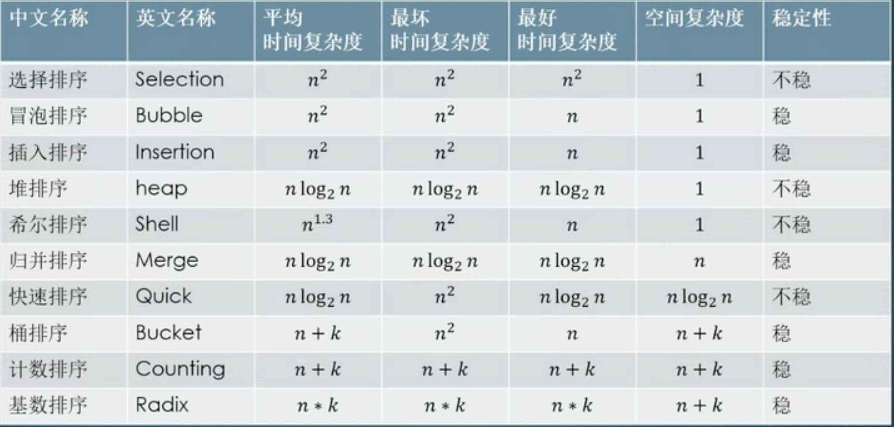

#数据结构

##算法

### 排序

    《忆排序面试我最强》
    选泡插，
    快归堆希统计基，
    恩方恩老恩一三
    对恩加K恩乘K,
    不稳稳稳不稳稳，
    不稳不稳稳稳稳!
    
    《改编》
    选泡插，n平方
    快堆归，n老n
    希尔n13
    桶计n+k
    基数n*k
    泡桶插归计基稳
    快选堆希永不稳
来自[bilibili][0]

[0]:https://www.bilibili.com/video/av46648286